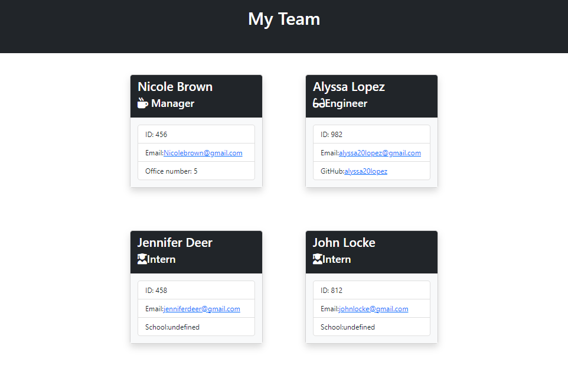

# Team Profile Generator

Module 10: Object-Oriented Programming

## Table of Contents
1. [Description](#description)
2. [Submission](#submission)
3. [Usage](#usage)
4. [Visuals](#visuals)

## Description
This is a Node.js command-line application that will take in information about employees on a software engineering team and will generate an HTML webpage that displays summaries for each person. This will use an Inquirer and Jest package.

[GitHub Repo](https://github.com/alyssa20lopez/team-profile-generator)

## Submission

[HTML Sample Page](https://github.com/alyssa20lopez/team-profile-generator/blob/08ee7adc37380147f73194f00cc48f145e20e564/sample-page.html) 

## Usage
To use this application, first clone the project and navigate to VS Code. In the command-line, install the following packages:
- npm i inquirer@8.2.4
- npm i jest
To start the application, type 'node indez.js' in the command-line.

## Visuals
Here is a visual of the front-end of the webpage design and walkthrough video.

<!-- Link to Walkthrough Video -->
[Click this link to access the walkthrough video](https://drive.google.com/file/d/1IwlalUKHNzmmJyYSRRIMdsLiB4NsU7Dc/view) 
